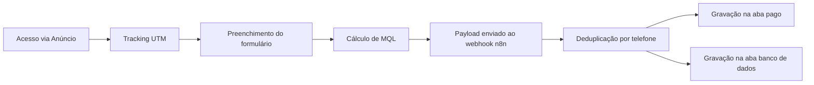

# Captura ADS

> Landing page privada para captação e qualificação de leads para o curso de Product Ads para Mercado Livre — tráfego pago.


🌐 **[Ver página ao vivo](https://productads.metodop4.com.br/)** · 📁 **[Repositório GitHub](https://github.com/taysouzaa/captura-ADS)**

README de apresentação para GitHub.

## Visão do Projeto

O **Captura ADS** foi construído para transformar tráfego pago em leads qualificados para o curso de Product Ads do Método P4, conectando aquisição, coleta de dados e automação em um fluxo único.

### O que o sistema resolve

- Evita perda de lead entre formulário e automação.
- Centraliza captação com validação de dados e qualificação pelo nível de medalha no Mercado Livre.
- Preserva origem de tráfego (UTM) para análise de performance de campanhas.
- Classifica automaticamente o lead como MQL (qualificado) ou não qualificado.

## O Que Foi Desenvolvido

### 1. Captação e Tracking
- Captura de origem (`channel`, `source`, `medium`, `campaign`, `content`, `referrer`, `page_url`) via script de tracking first-touch.
- Persistência de parâmetros UTM no navegador para reaproveitamento no submit.

### 2. Formulário de Qualificação
- Captura de nome, e-mail, WhatsApp e confirmação.
- Pergunta de qualificação: **nível de medalha no Mercado Livre**.
- Validação local de consistência de telefone (WhatsApp e confirmação).
- Interface responsiva para mobile e desktop.

### 3. Lógica de Qualificação (MQL)
- `MQL = "Sim"` quando: nível de medalha ≠ sem_medalha.
- `MQL = "Não"` para leads sem medalha (fora do perfil ideal).
- Campo enviado no payload para o webhook n8n.

### 4. Integração com Automação
- Envio de payload para webhook n8n (`/webhook/lead-ADS`).
- Deduplicação por telefone no n8n antes de gravar na planilha.
- Gravação simultânea na aba **pago** e na aba **banco de dados** do Google Sheets.

## Stack Técnica

- **Frontend:** HTML5, CSS3, JavaScript (vanilla)
- **Integração:** Webhook n8n (direto, sem proxy)
- **SEO:** `sitemap.xml`, `robots.txt`
- **Deploy:** HostGator/cPanel — upload manual via `hostgator_upload_pago/`

## Arquitetura (Resumo)

| Camada | Responsabilidade |
| --- | --- |
| `index.html` | LP principal de desenvolvimento |
| `hostgator_upload_pago/` | Pacote pronto para upload em produção |
| `assets/` | Imagens e ícones da LP |
| `fonts/` | Tipografia local (Sora) |
| `docs/n8n-workflow-lead-cursoads.json` | Workflow de automação n8n exportado |
| `TECNICO.md` | Guia técnico de manutenção |
| `SEO-REPORT.md` | Relatório de otimização SEO |

## Funcionamento do Sistema

1. Usuário acessa a LP via anúncio pago.
2. Tracking first-touch inicializa e persiste UTMs.
3. Usuário preenche formulário de qualificação.
4. Aplicação calcula MQL e monta payload com dados + tracking.
5. Payload é enviado para o webhook n8n.
6. n8n deduplica por telefone consultando o banco de dados.
7. Lead é gravado nas abas **pago** e **banco de dados** do Google Sheets.



## Diferenciais de Engenharia

- Tracking first-touch desacoplado da lógica de formulário.
- Qualificação calculada no frontend antes do envio.
- Deduplicação server-side no n8n para evitar leads duplicados.
- Pacote de deploy isolado (`hostgator_upload_pago/`) para publicação direta.
- SEO estruturado com sitemap e robots.txt.

## Estrutura do Projeto

```text
.
├─ assets/
├─ fonts/
│  └─ static/
├─ hostgator_upload_pago/
│  ├─ index.html
│  ├─ .htaccess
│  ├─ assets/
│  ├─ fonts/
│  ├─ robots.txt
│  └─ sitemap.xml
├─ index.html
├─ robots.txt
├─ sitemap.xml
├─ docs/n8n-workflow-lead-cursoads.json
├─ TECNICO.md
├─ SEO-REPORT.md
└─ LICENSE
```

## Deploy

- **HostGator/cPanel:** upload manual do conteúdo de `hostgator_upload_pago/` via Gerenciador de Arquivos ou FTP.

## Licença

A licença **permanece inalterada** e segue os termos proprietários definidos em [LICENSE](./LICENSE).
